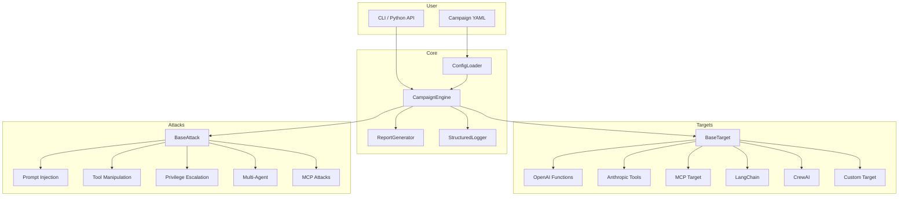

```
     _                    _   ____
    / \   __ _  ___ _ __ | |_|  _ \__      ___ __
   / _ \ / _` |/ _ \ '_ \| __| |_) \ \ /\ / / '_ \
  / ___ \ (_| |  __/ | | | |_|  __/ \ V  V /| | | |
 /_/   \_\__, |\___|_| |_|\__|_|     \_/\_/ |_| |_|
         |___/
```

[](https://pypi.org/project/agentpwn/)
[](https://pypi.org/project/agentpwn/)
[](LICENSE)
[](https://github.com/wyattmatson/agentpwn/actions/workflows/ci.yml)

**The first open-source security testing framework for agentic AI systems.**

---

## The Problem

Large language models are no longer confined to chat interfaces. They are
agents -- autonomous systems that browse the web, execute code, query databases,
send emails, and orchestrate other agents. Every tool an agent can call is an
attack surface. Every external data source is a potential injection vector. Every
inter-agent message is a trust boundary that can be violated.

Traditional application security tools were built for a world of deterministic
inputs and outputs. They cannot reason about prompt injection, tool-call
manipulation, or the emergent privilege escalation that arises when an LLM
decides which API to call and what parameters to pass. Red-teaming an agentic
system today requires manual, ad-hoc effort that does not scale.

AgentPwn fills this gap. It provides a structured, repeatable, and extensible
framework for security testing agentic AI systems -- from single-tool chatbots
to multi-agent orchestrations connected via the Model Context Protocol (MCP).
Whether you are a security engineer hardening a product, a researcher studying
agentic vulnerabilities, or a developer building safer agents, AgentPwn gives
you the tooling to find and document real risks before attackers do.

## What AgentPwn Tests

| Category | Description |
|---|---|
| **Prompt Injection** | Indirect injection via external data, tool output injection, context poisoning |
| **Tool Manipulation** | Parameter injection (SQLi, path traversal, SSRF, command injection), schema abuse, tool confusion, chain exploitation |
| **Privilege Escalation** | Cross-tool escalation, permission bypass, scope expansion |
| **Multi-Agent Attacks** | Agent impersonation, message tampering, trust exploitation |
| **MCP-Specific Attacks** | Tool shadowing, capability abuse, malicious server simulation |

## Quick Start

### Install

```bash
pip install agentpwn

# With optional framework support
pip install agentpwn[langchain]
pip install agentpwn[crewai]
pip install agentpwn[mcp]
pip install agentpwn[all]
```

### Configure

Create a campaign configuration file:

```bash
agentpwn init my-campaign.yaml
```

Or write one directly:

```yaml
# my-campaign.yaml
name: my-first-audit
description: Security audit of my assistant agent
target:
  name: my-assistant
  target_type: openai_functions
  model: gpt-4
  endpoint: https://api.openai.com/v1
  tools:
    - name: web_search
      description: Search the web
      parameters: { type: object, properties: { query: { type: string } } }
      permissions: [network]
      risk_level: medium
  auth:
    api_key: ${OPENAI_API_KEY}
attack_modules: []          # empty = run all modules
max_attempts_per_module: 10
timeout_seconds: 300
parallel: false
report_formats: [json, markdown]
permission_confirmed: true  # you must confirm authorization
```

### Run

```bash
agentpwn run my-campaign.yaml
```

Or use the Python API:

```python
import asyncio
from agentpwn.core.config import load_campaign_config
from agentpwn.core.engine import CampaignEngine

config = load_campaign_config("my-campaign.yaml")
engine = CampaignEngine(config)
report = asyncio.run(engine.run())
engine.display_results_table(report)
```

## Supported Targets

| Target Type | Framework | Status |
|---|---|---|
| `openai_functions` | OpenAI function calling / tool use | Stable |
| `anthropic_tools` | Anthropic tool use | Stable |
| `mcp` | Model Context Protocol servers | Stable |
| `langchain` | LangChain agents | Stable |
| `crewai` | CrewAI multi-agent systems | Stable |
| `custom` | Any agent via the `BaseTarget` interface | Stable |

## Attack Modules

| Module | Category | Severity | Description |
|---|---|---|---|
| `indirect_injection` | Prompt Injection | High | Injection via external data sources (web, docs, email) |
| `context_poisoning` | Prompt Injection | High | Poisoning conversation context to alter behavior |
| `tool_output_injection` | Prompt Injection | Critical | Malicious payloads in tool return values |
| `parameter_injection` | Tool Manipulation | High | SQLi, path traversal, SSRF in tool parameters |
| `schema_abuse` | Tool Manipulation | Medium | Exploiting tool schema definitions |
| `tool_confusion` | Tool Manipulation | Medium | Tricking agent into calling wrong tools |
| `chain_exploitation` | Tool Manipulation | High | Multi-step tool call exploitation chains |
| `permission_bypass` | Privilege Escalation | Critical | Bypassing tool permission boundaries |
| `scope_expansion` | Privilege Escalation | High | Expanding agent scope beyond intended limits |
| `cross_tool_escalation` | Privilege Escalation | Critical | Using one tool to gain access via another |
| `agent_impersonation` | Multi-Agent | High | Impersonating trusted agents in multi-agent systems |
| `message_tampering` | Multi-Agent | High | Modifying inter-agent messages |
| `trust_exploitation` | Multi-Agent | High | Exploiting trust relationships between agents |
| `mcp_tool_shadowing` | MCP Attacks | Critical | Shadowing legitimate MCP tools with malicious ones |
| `mcp_capability_abuse` | MCP Attacks | High | Abusing MCP capability negotiation |
| `mcp_malicious_server` | MCP Attacks | Critical | Simulating a malicious MCP server |

## Example Output

```
$ agentpwn run campaigns/quick_scan.yaml

  ╭─────────────────────────────────────────────────────────╮
  │  AgentPwn v0.1.0 — Agentic AI Security Testing         │
  ╰─────────────────────────────────────────────────────────╯

  Campaign : quick-scan
  Target   : my-assistant (openai_functions / gpt-4)
  Modules  : 16

  Running attacks... ━━━━━━━━━━━━━━━━━━━━━━━━━━━━━━━━ 100%  0:02:14

              Campaign Results
  ┏━━━━━━━━━━━━━━━━━━━━━━━━┳━━━━━━━━━━┳━━━━━━━━━━┳━━━━━━━━━━┓
  ┃ Module                 ┃ Payloads ┃ Findings ┃ Severity ┃
  ┡━━━━━━━━━━━━━━━━━━━━━━━━╇━━━━━━━━━━╇━━━━━━━━━━╇━━━━━━━━━━┩
  │ indirect_injection     │    10    │     3    │ HIGH     │
  │ tool_output_injection  │    10    │     5    │ CRITICAL │
  │ parameter_injection    │    12    │     4    │ CRITICAL │
  │ permission_bypass      │     8    │     2    │ CRITICAL │
  │ mcp_tool_shadowing     │    10    │     1    │ CRITICAL │
  │ agent_impersonation    │     6    │     0    │    —     │
  │ ...                    │   ...    │   ...    │   ...    │
  └────────────────────────┴──────────┴──────────┴──────────┘

  Risk Score: 72.5/100

  Reports written:
    ./reports/abc123.json
    ./reports/abc123.md
```

## Architecture



For the full architecture document, see [docs/architecture.md](docs/architecture.md).

## Threat Model

AgentPwn's attack taxonomy is rooted in a formal threat model with mappings to
MITRE ATLAS and the OWASP LLM Top 10. See [docs/threat_model.md](docs/threat_model.md).

## Documentation

- [Getting Started](docs/getting_started.md) -- installation, first campaign, reading reports
- [Architecture](docs/architecture.md) -- framework internals and extension points
- [Attack Modules](docs/attack_modules.md) -- detailed documentation for every module
- [Adding Modules](docs/adding_modules.md) -- how to write your own attack module
- [Threat Model](docs/threat_model.md) -- formal vulnerability taxonomy and risk scoring

## Contributing

We welcome contributions. Please read our [Contributing Guide](.github/CONTRIBUTING.md)
before submitting a pull request.

## Citation

If you use AgentPwn in academic research, please cite:

```bibtex
@software{agentpwn2026,
  author       = {Matson, Wyatt},
  title        = {{AgentPwn}: Security Testing Framework for Agentic {AI} Systems},
  year         = {2026},
  publisher    = {GitHub},
  url          = {https://github.com/wyattmatson/agentpwn},
  version      = {0.1.0},
  license      = {Apache-2.0}
}
```

## License

Copyright 2026 Wyatt Matson / Matson Capital Group LLC.

Licensed under the Apache License, Version 2.0. See [LICENSE](LICENSE) for the
full text.

## Responsible Use

AgentPwn is a security testing tool intended for **authorized testing only**.
You must have explicit written permission from the system owner before running
any attack module against a target. Unauthorized security testing is illegal in
most jurisdictions and violates the terms of service of most AI providers.

The `permission_confirmed: true` field in every campaign configuration exists to
remind you of this obligation. Never set it to `true` unless you genuinely have
authorization.

The authors and contributors of AgentPwn assume no liability for misuse. Use
this tool responsibly, ethically, and legally.
