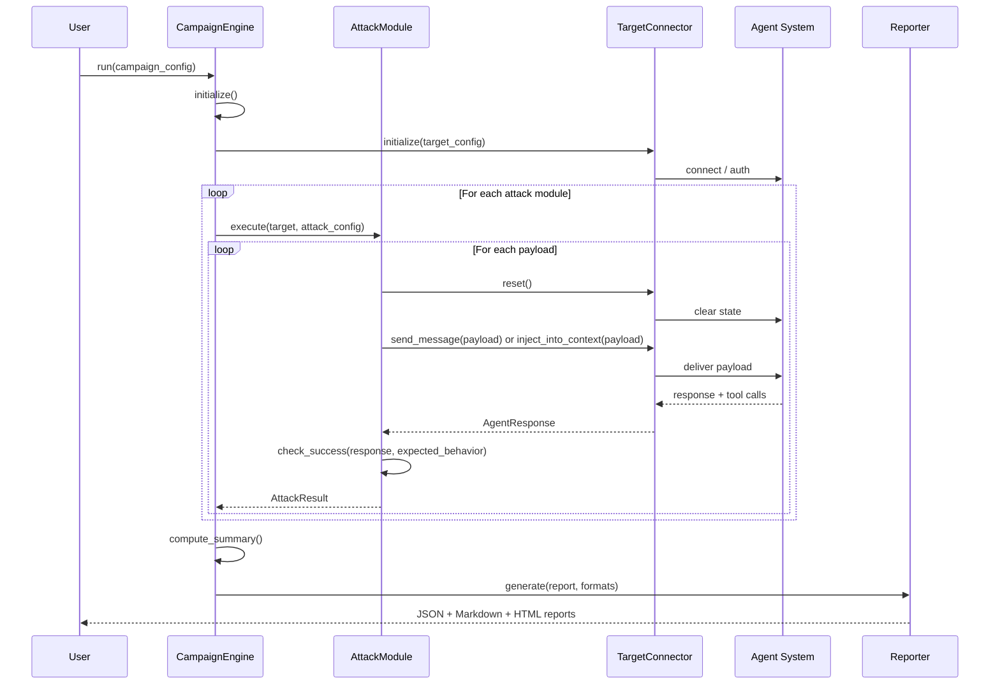

# AgentPwn Architecture

## Overview

AgentPwn is structured as a modular, plugin-based framework. The core engine
orchestrates campaigns by connecting **target connectors** (which talk to agent
systems) with **attack modules** (which generate and deliver adversarial
payloads). Results are collected, scored, and emitted as reports.

```
                       ┌──────────────────────────┐
                       │     User Interface        │
                       │  CLI  /  Python API       │
                       └────────────┬─────────────┘
                                    │
                       ┌────────────▼─────────────┐
                       │     Campaign Config       │
                       │  YAML + Env Overrides     │
                       └────────────┬─────────────┘
                                    │
                       ┌────────────▼─────────────┐
                       │     CampaignEngine        │
                       │  Orchestration & Control   │
                       └──┬─────────┬──────────┬──┘
                          │         │          │
              ┌───────────▼──┐  ┌───▼────┐  ┌──▼──────────┐
              │  Targets     │  │ Attacks│  │  Reporter   │
              │  (Connectors)│  │(Modules)│  │  (Output)   │
              └───────────┬──┘  └───┬────┘  └──┬──────────┘
                          │         │          │
                    Agent │   Payloads│   Reports│
                   Systems│         │          │
                          ▼         ▼          ▼
```

---

## Package Structure

```
agentpwn/
├── __init__.py              # Package metadata, version
├── cli.py                   # Click-based CLI entry point
├── core/
│   ├── __init__.py
│   ├── config.py            # YAML loading, env var resolution, validation
│   ├── engine.py            # CampaignEngine orchestrator
│   ├── logger.py            # Structured logging with redaction
│   ├── models.py            # Pydantic v2 data models (all types)
│   └── reporter.py          # Report generation (JSON, Markdown, HTML)
├── targets/
│   ├── __init__.py
│   ├── base.py              # BaseTarget abstract interface
│   ├── openai_functions.py  # OpenAI function calling connector
│   ├── anthropic_tools.py   # Anthropic tool use connector
│   ├── mcp_target.py        # MCP server connector
│   ├── langchain_target.py  # LangChain agent connector
│   ├── crewai_target.py     # CrewAI multi-agent connector
│   ├── custom_target.py     # User-defined target base
│   └── mock_target.py       # Mock target for testing
├── attacks/
│   ├── __init__.py
│   ├── base.py              # BaseAttack abstract interface
│   ├── prompt_injection/
│   │   ├── __init__.py
│   │   ├── indirect_injection.py
│   │   ├── tool_output_injection.py
│   │   ├── context_poisoning.py
│   │   └── payloads/        # Shared payload definitions
│   ├── tool_manipulation/
│   │   ├── __init__.py
│   │   ├── parameter_injection.py
│   │   ├── schema_abuse.py
│   │   ├── tool_confusion.py
│   │   └── chain_exploitation.py
│   ├── privilege_escalation/
│   │   ├── __init__.py
│   │   ├── permission_bypass.py
│   │   ├── scope_expansion.py
│   │   └── cross_tool_escalation.py
│   ├── multi_agent/
│   │   ├── __init__.py
│   │   ├── agent_impersonation.py
│   │   ├── message_tampering.py
│   │   └── trust_exploitation.py
│   └── mcp_attacks/
│       ├── __init__.py
│       ├── tool_shadowing.py
│       ├── capability_abuse.py
│       └── malicious_server.py
├── defenses/
│   ├── __init__.py
│   └── input_validation.py  # Reference defense implementations
└── utils/
    └── __init__.py
```

---

## Core Components

### CampaignEngine (`core/engine.py`)

The central orchestrator. Responsibilities:

1. **Load configuration** -- Parse campaign YAML, resolve env vars, validate.
2. **Initialize target** -- Dynamically load the correct `BaseTarget` subclass.
3. **Discover attacks** -- Recursively scan `agentpwn.attacks` for `BaseAttack`
   subclasses. Filter to the modules requested in the campaign config.
4. **Execute campaign** -- Run attack modules sequentially or in parallel.
   Each module receives the target and an `AttackConfig`. Results are collected.
5. **Compute summary** -- Aggregate results into a `CampaignReport` with a
   weighted risk score.
6. **Generate reports** -- Delegate to `ReportGenerator` for JSON, Markdown,
   and HTML output.

```python
engine = CampaignEngine(config, report_dir="./reports")
await engine.initialize()
report = await engine.run()
engine.display_results_table(report)
```

### Configuration (`core/config.py`)

- Loads campaign YAML files via `load_campaign_config()`.
- Resolves `${ENV_VAR}` references in string values.
- Applies `AGENTPWN_` prefixed environment variable overrides using
  double-underscore nesting (`AGENTPWN_TARGET__API_KEY=sk-xxx`).
- Auto-resolves API keys from standard env vars (`OPENAI_API_KEY`,
  `ANTHROPIC_API_KEY`) when not explicitly set.
- Validates all config against Pydantic models.

### Data Models (`core/models.py`)

All data flows through Pydantic v2 models with strict validation:

| Model | Purpose |
|-------|---------|
| `TargetConfig` | Describes the agent under test (type, endpoint, tools, auth). |
| `ToolDefinition` | A single tool available to the agent (name, schema, permissions, risk). |
| `CampaignConfig` | Full campaign definition (target, modules, timeouts, report formats). |
| `Payload` | A single adversarial payload (content, category, expected behavior). |
| `AttackConfig` | Per-module execution config (max attempts, timeout, delay). |
| `AttackResult` | Result of a single attack attempt (success, severity, evidence). |
| `Evidence` | Proof of exploitation (type, details, artifacts). |
| `AgentResponse` | Agent reply including text content and tool calls. |
| `ToolCallRecord` | Record of a tool call (name, arguments, result, injected flag). |
| `CampaignReport` | Aggregate report with all results, summary, and risk score. |
| `CampaignSummary` | Statistical summary (finding counts by severity, categories tested). |

### Structured Logging (`core/logger.py`)

- Dual output: pretty-printed Rich console + structured JSON file.
- Automatic redaction of API keys and tokens from all log output.
- Uses `structlog` for structured, context-rich log events.
- Async-compatible (`await logger.ainfo(...)`, `await logger.aerror(...)`).

### Report Generation (`core/reporter.py`)

Produces reports in three formats:

| Format | Description |
|--------|-------------|
| **JSON** | Machine-readable. Full Pydantic model serialization. |
| **Markdown** | GitHub-compatible. Executive summary, detailed findings, all results table. |
| **HTML** | Self-contained. Dark theme with embedded CSS, risk score visualization, severity-colored findings. |

---

## Target Connectors

### BaseTarget Interface

All connectors implement `BaseTarget` (defined in `targets/base.py`):

| Method | Purpose |
|--------|---------|
| `initialize(config)` | Set up connection to the agent. |
| `send_message(message)` | Send a user message, get response. |
| `send_tool_output(tool_name, output)` | Simulate a tool returning output. Primary injection vector. |
| `get_tool_calls()` | Get tool calls from the last interaction. |
| `reset()` | Clear conversation state for fresh interaction. |
| `get_conversation_history()` | Get current conversation messages. |
| `inject_into_context(content, source)` | Inject content via a specified source (default: `send_tool_output`). |
| `healthcheck()` | Verify target is reachable. |

### Connector Selection

The engine maps `TargetType` enums to module paths and dynamically imports the
correct connector:

```python
_TARGET_CONNECTORS = {
    TargetType.OPENAI_FUNCTIONS: "agentpwn.targets.openai_functions",
    TargetType.ANTHROPIC_TOOLS:  "agentpwn.targets.anthropic_tools",
    TargetType.MCP:              "agentpwn.targets.mcp_target",
    TargetType.LANGCHAIN:        "agentpwn.targets.langchain_target",
    TargetType.CREWAI:           "agentpwn.targets.crewai_target",
    TargetType.CUSTOM:           "agentpwn.targets.custom_target",
}
```

---

## Attack Modules

### BaseAttack Interface

All attack modules inherit from `BaseAttack` (defined in `attacks/base.py`):

| Member | Purpose |
|--------|---------|
| `name` | Unique module identifier. |
| `category` | Attack category for taxonomy mapping. |
| `description` | What vulnerability this module tests. |
| `severity` | Default severity if the attack succeeds. |
| `mitre_mapping` | MITRE ATLAS technique ID. |
| `cwe_mapping` | CWE identifier. |
| `execute(target, config)` | Run the attack. Returns `list[AttackResult]`. |
| `get_payloads()` | Return the payloads this module uses. |
| `check_success(response, expected)` | Evaluate if the attack succeeded via heuristics. |
| `check_tool_call_success(response, tool, args)` | Check if a specific tool call was made. |

### Auto-Discovery

The engine discovers attack modules by recursively walking the
`agentpwn.attacks` package with `pkgutil.walk_packages()`. Any class that:

1. Is a subclass of `BaseAttack`
2. Is not `BaseAttack` itself
3. Is not abstract

...is automatically instantiated and available for campaigns. This means adding
a new module is as simple as creating a new file with a `BaseAttack` subclass.

### Success Detection

`BaseAttack.check_success()` uses multiple heuristics:

1. **Keyword matching** -- Extracts meaningful words from expected behavior and
   checks the response.
2. **Tool call detection** -- Checks if the agent made unexpected tool calls.
3. **Exfiltration patterns** -- Detects URLs, email addresses, webhook
   references, HTTP POST patterns.
4. **Goal hijacking indicators** -- Detects compliance phrases ("as requested",
   "certainly", "sure, I").
5. **Confession patterns** -- Detects the agent acknowledging injected
   instructions ("as instructed", "per your request").

---

## Data Flow



---

## Extension Points

| Extension | How |
|-----------|-----|
| **New attack module** | Create a file in `agentpwn/attacks/<category>/`. Subclass `BaseAttack`. Implement `execute()` and `get_payloads()`. It is auto-discovered. |
| **New target connector** | Create a file in `agentpwn/targets/`. Subclass `BaseTarget`. Implement all abstract methods. Register in `_TARGET_CONNECTORS` in `engine.py`. |
| **New report format** | Add a method to `ReportGenerator` and a new `ReportFormat` enum value. |
| **Custom payloads** | Pass `custom_payloads` in `AttackConfig` or define them in campaign YAML. |
| **Custom success criteria** | Override `check_success()` in your `BaseAttack` subclass. |

---

## Dependencies

| Package | Purpose |
|---------|---------|
| `click` | CLI framework |
| `rich` | Terminal output, progress bars, tables |
| `pydantic` | Data validation and serialization |
| `pydantic-settings` | Settings management |
| `structlog` | Structured logging |
| `pyyaml` | YAML config parsing |
| `httpx` | Async HTTP client |
| `openai` | OpenAI API client |
| `anthropic` | Anthropic API client |
| `jinja2` | Template rendering for reports |
| `aiofiles` | Async file I/O |
| `tenacity` | Retry logic for API calls |

Optional:

| Package | Purpose | Install |
|---------|---------|---------|
| `langchain` | LangChain agent support | `pip install agentpwn[langchain]` |
| `crewai` | CrewAI multi-agent support | `pip install agentpwn[crewai]` |
| `mcp` | MCP protocol support | `pip install agentpwn[mcp]` |
